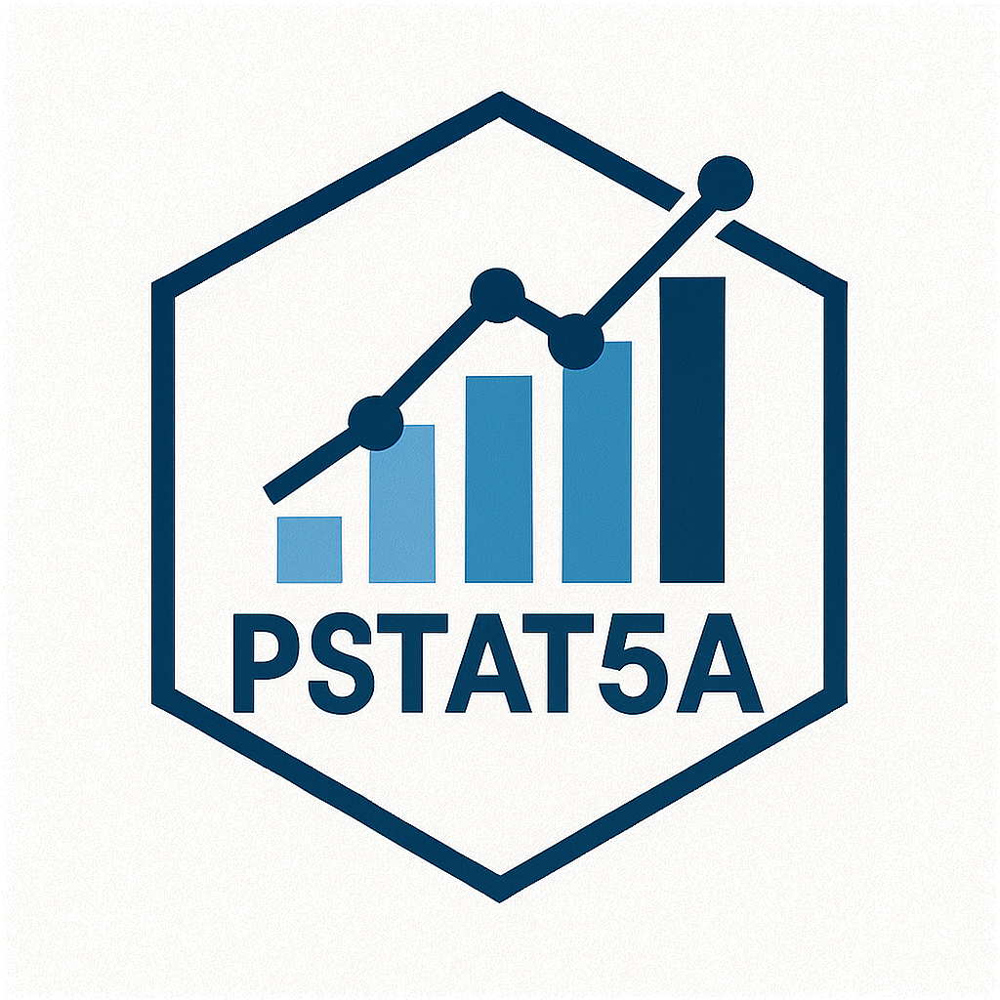

<div align="right">
  
</div>

# PSTAT5A: Understanding Data

A comprehensive course website for PSTAT5A (Understanding Data) at UCSB, featuring interactive lectures, labs, worksheets, and resources built with Quarto.

## 📚 Course Overview

PSTAT5A is an introductory statistics course that covers:
- **Descriptive Statistics**: Data visualization, measures of central tendency and variability
- **Probability Foundations**: Basic probability concepts, conditional probability, and Bayes' theorem
- **Random Variables**: Discrete and continuous distributions
- **Statistical Inference**: Confidence intervals and hypothesis testing
- **Linear Regression**: Basic regression analysis and modeling

## 🚀 Features

- **Interactive Lectures**: Reveal.js presentations with embedded Python code execution
- **Jupyter Notebooks**: Hands-on labs with real data analysis
- **Worksheets**: Practice problems with solutions
- **Responsive Design**: Mobile-friendly interface
- **Search Functionality**: Easy navigation through course materials
- **Modern UI**: Clean, professional design with smooth animations
- **Tabbed Schedule**: Organized weekly content with filtering options
- **Real-time Code Execution**: Live Python code examples in lectures
- **Mathematical Typesetting**: Beautiful math rendering with KaTeX
- **Cross-platform**: Works on Windows, macOS, and Linux

## 🛠️ Technology Stack

- **Quarto**: Scientific and technical publishing system
- **Python**: Data analysis and statistical computing
- **Reveal.js**: Interactive slide presentations
- **Jupyter**: Interactive computing and data science
- **KaTeX**: Fast math typesetting
- **Bootstrap**: Responsive CSS framework

## 🎯 What You'll Learn

This course provides a comprehensive introduction to statistics and data analysis, covering:

### 📊 **Descriptive Statistics**
- Data visualization and exploration
- Measures of central tendency and variability
- Understanding data distributions

### 🎲 **Probability Foundations**
- Basic probability concepts and rules
- Conditional probability and independence
- Bayes' theorem and applications

### 📈 **Statistical Inference**
- Sampling methods and strategies
- Confidence intervals for means and proportions
- Hypothesis testing fundamentals

### 🔍 **Data Analysis**
- Linear regression basics
- Model interpretation and validation
- Real-world applications

## 📚 Course Content

### Week 1: Introduction & Descriptive Statistics
- Introduction to statistics and data analysis
- Descriptive statistics fundamentals
- Data visualization techniques

### Week 2: Probability Foundations
- Basic probability concepts
- Conditional probability
- Bayes' theorem

### Week 3: Conditional Probability, Counting & Random Variables
- Advanced probability topics
- Counting principles
- Introduction to random variables

### Week 4: Random Variables & Distributions
- Continuous random variables
- Probability distributions
- Sampling and confidence intervals

### Week 5: Inference & Statistical Modeling
- Sampling strategies
- Confidence intervals
- Hypothesis testing

### Week 6: Hypothesis Testing, Regression & Course Wrap-Up
- Advanced hypothesis testing
- Linear regression basics
- Course review and applications

## 🚀 Quick Start

Want to get up and running quickly? Here's the fastest way:

```bash
# Clone the repository
git clone https://github.com/yourusername/PSTAT5A.git
cd PSTAT5A/web/PSTAT5A

# Install dependencies
pip install -r requirements.txt

# Start the development server
quarto preview
```

Then open your browser to `http://localhost:4292/` and you're ready to go!

## 🛠️ Getting Started

### Prerequisites

- [Quarto](https://quarto.org/docs/get-started/) (latest version)
- [Python](https://www.python.org/) (3.8 or higher)
- [Jupyter](https://jupyter.org/) (for interactive notebooks)

### Installation

1. **Clone the repository**
   ```bash
   git clone https://github.com/yourusername/PSTAT5A.git
   cd PSTAT5A/web/PSTAT5A
   ```

2. **Install Python dependencies**
   ```bash
   pip install -r requirements.txt
   ```

3. **Install Quarto** (if not already installed)
   ```bash
   # macOS
   brew install quarto
   
   # Windows
   # Download from https://quarto.org/docs/get-started/
   
   # Linux
   # Follow instructions at https://quarto.org/docs/get-started/
   ```

### Development

1. **Start the development server**
   ```bash
   quarto preview
   ```

2. **Build the website**
   ```bash
   quarto render
   ```

3. **View the site**
   Open your browser and navigate to `http://localhost:4292/`

## 📖 Usage

### For Students
- **Navigate the Schedule**: Use the tabbed interface to browse weekly content
- **Interactive Lectures**: Click through slides and run code examples
- **Download Materials**: Access labs, worksheets, and solutions
- **Practice Problems**: Work through exercises with step-by-step solutions
- **Real-time Code**: Execute Python code directly in the browser


## 🤝 Contributing

We welcome contributions! Please feel free to:

1. **Report bugs** by opening an issue
2. **Suggest improvements** through discussions
3. **Submit pull requests** for fixes and enhancements
4. **Share feedback** on course materials

### Contributing Guidelines

1. Fork the repository
2. Create a feature branch (`git checkout -b feature/amazing-feature`)
3. Commit your changes (`git commit -m 'Add amazing feature'`)
4. Push to the branch (`git push origin feature/amazing-feature`)
5. Open a Pull Request

## 📄 License

This project is licensed under the **MIT License** - see the [LICENSE](LICENSE) file for details.

The MIT License is a permissive license that allows for:
- **Commercial use**: You can use this software for commercial purposes
- **Modification**: You can modify the software
- **Distribution**: You can distribute the software
- **Private use**: You can use and modify the software without distributing it


## 👨‍🏫 Instructor

**Narjes Mathlouthi**  
Department of Statistics and Applied Probability  
University of California, Santa Barbara

## 🌐 Deployment

### Local Development
```bash
quarto preview
```

### Production Build
```bash
quarto render
```

### Hosting Options
- **GitHub Pages**: Free hosting for public repositories
- **Netlify**: Easy deployment with drag-and-drop
- **Vercel**: Fast deployment with automatic builds
- **University Servers**: Host on your institution's web servers

### GitHub Pages Setup
1. Enable GitHub Pages in your repository settings
2. Set source to `/docs` folder
3. Your site will be available at `https://yourusername.github.io/PSTAT5A/`

## 📞 Contact

- **Email**: nmathlouthi@ucsb.edu
- **Course Website**: [https//pstat5a.com](https://pstat5a.com/)


## 📈 Project Status


---

<!-- **Note**: This course website is actively maintained and updated throughout the academic quarter. Please check back regularly for the latest materials and announcements. -->
